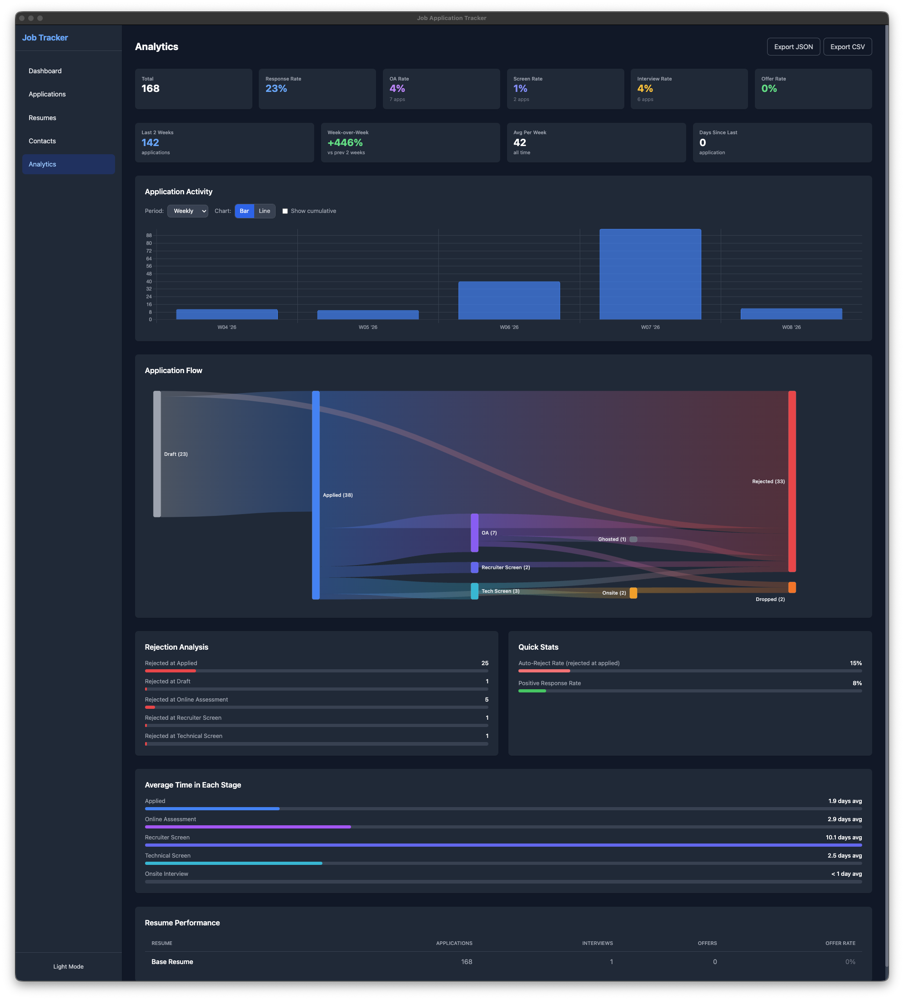

# Job Tracker



A desktop application for tracking job applications with analytics, resume management, and keyword matching. Built with Electron, Vue 3, and SQLite — all data stays local on your machine.

## Features

- **Application Tracking** — Log and manage job applications with company, title, location, salary, and status
- **Status Timeline** — Track progress through stages: Applied → Phone Screen → Interview → Offer / Rejected
- **Resume Manager** — Store multiple resumes with keyword profiles
- **Keyword Matching** — Match your resume keywords against job descriptions to identify gaps
- **Analytics Dashboard** — Visualize your job search with Sankey diagrams, pie charts, and time series
- **Contact Management** — Link contacts to applications and track relationships
- **Local Storage** — All data stored locally in SQLite, nothing sent to the cloud

## Download

Download the latest release for your platform from the [Releases](https://github.com/XhovaniM8/still-not-hired/releases) page:

| Platform | Download |
|----------|----------|
| **macOS** | `.dmg` (installer) or `.zip` |
| **Windows** | `.exe` (installer) or portable `.exe` |
| **Linux** | `.AppImage` or `.deb` |

## Build from Source

Requirements: Node.js 18+

```bash
# Clone the repository
git clone https://github.com/XhovaniM8/still-not-hired.git
cd still-not-hired

# Install dependencies
npm install

# Run in development mode
npm run electron:dev

# Build for your platform
npm run electron:build
```

## Development

```bash
# Start dev server (web only)
npm run dev

# Start Electron dev mode
npm run electron:dev

# Build for specific platforms
npm run electron:build:mac
npm run electron:build:win
npm run electron:build:linux
```

## Tech Stack

| Layer | Technology |
|-------|------------|
| Frontend | Vue 3, Pinia, Vue Router, Tailwind CSS |
| Desktop | Electron |
| Database | better-sqlite3 (SQLite) |
| Charts | Chart.js, D3.js, D3-Sankey |
| Build | Vite, electron-builder |

## Known Issues

- **Keyword matching uses a predefined dictionary** — Skills not in the built-in list won't be detected unless they appear in an explicit skill section or follow CamelCase/alphanumeric patterns (e.g. `GraphQL`, `OAuth2`). Niche or domain-specific terms may be missed.
- **Resume keyword extraction is not automatic** — After pasting resume content in the editor, you must click "Extract keywords from content" to populate keywords. They are not extracted on save.
- **Match scores are unreliable with few saved jobs** — The TF-IDF analytics requires a reasonable corpus of saved job descriptions to be meaningful. With fewer than ~10 saved jobs, keyword frequency analysis produces noisy results.
- **No PDF import** — Resumes must be pasted as plain text or LaTeX source. PDF files cannot be imported directly.
- **macOS Gatekeeper warning** — The app is not code-signed. On first launch you may need to right-click → Open to bypass the "unidentified developer" warning.
- **Windows Defender / antivirus warning** — The installer is unsigned and may be flagged by Windows Defender or other antivirus software on first run.

## Contributing

Contributions are welcome! Please read [CONTRIBUTING.md](CONTRIBUTING.md) before submitting a pull request.

## License

[MIT](LICENSE) © XhovaniM8
